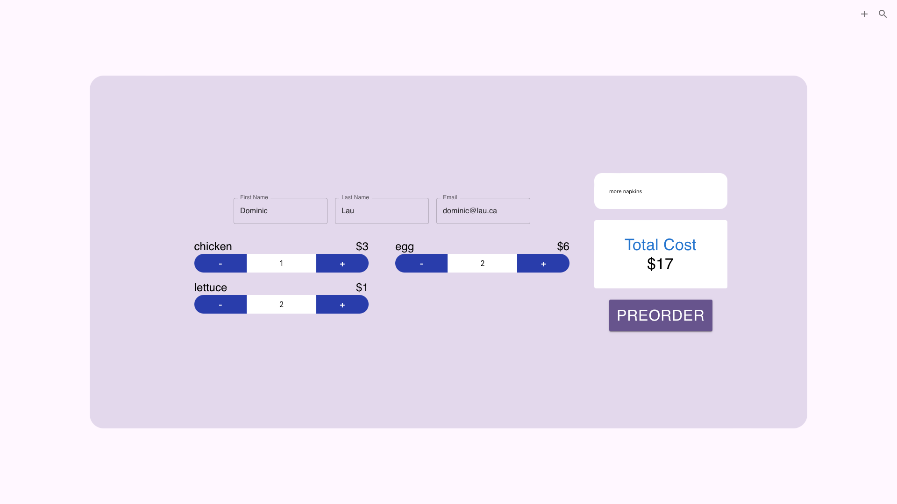
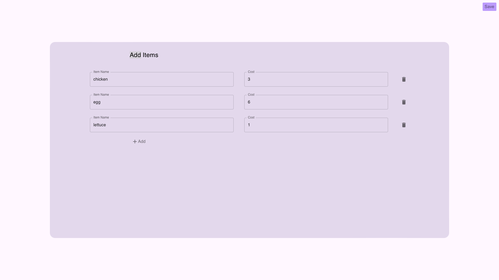
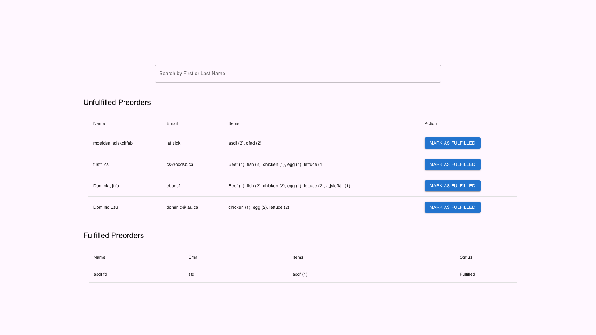

# Preodreing System

An ordering system that uses React for the front end and MySQL as the database. The user inputs item names, and when customers place orders, the user can enter details in text fields to specify the quantity. There is also a fulfillment page where the user can search for preorders and fulfill them.

